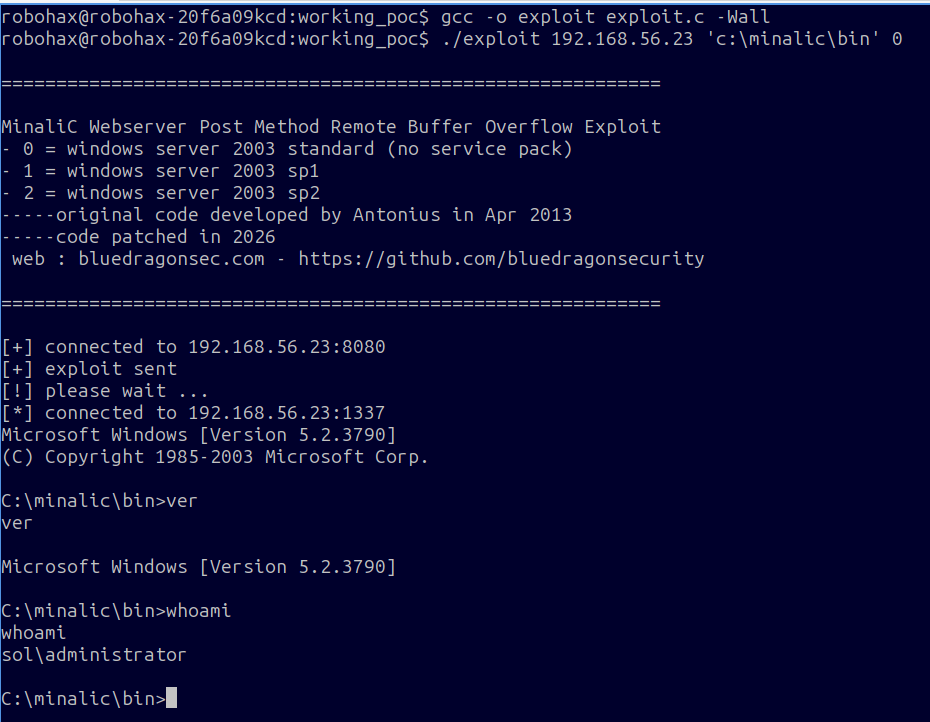
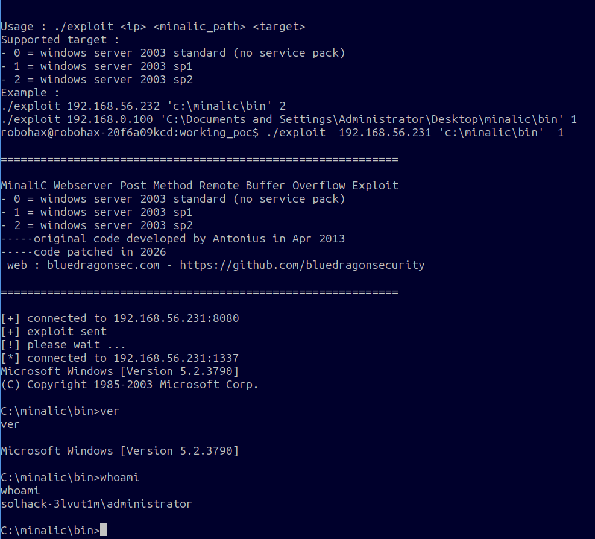

## minalic web server 2.0.0 http post remote stack overflow exploit for windows 32 bit

<pre>

============================================================

    MinaliC Webserver Post Method Remote Buffer Overflow Exploit
    Affected :  MinaliC Webserver 2.0.0
    -----original code developed by Antonius in Apr 2013
    -----code patched in 2026
    web : bluedragonsec.com - https://github.com/bluedragonsecurity

 
============================================================

compile :
    gcc -o exploit exploit.c -Wall

Usage : ./exploit <ip> <minalic_path> <target>

Supported target : 
    - 0 = windows server 2003 standard (no service pack)
    - 1 = windows server 2003 sp1
    - 2 = windows server 2003 sp2

Example : 
    ./exploit 192.168.56.232 'c:\\minalic\\bin' 2
    ./exploit 192.168.0.100 'C:\\Documents and Settings\\Administrator\\Desktop\\minalic\\bin' 1
    
</pre>

>
>This is the only version in internet that used post method in 2013.
>
>Since post method and get method used different code path, you can tell that I found the
>vulnerability for post method.

